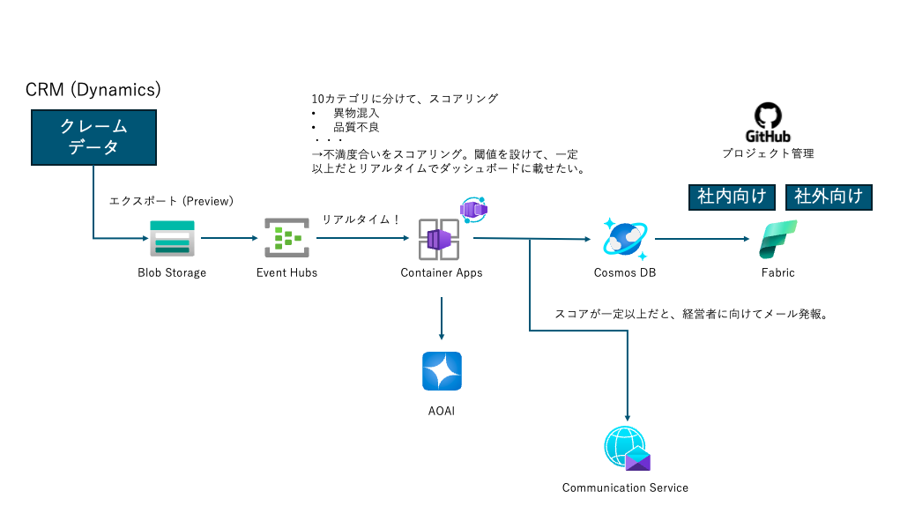

# 顧客クレームに対する可視化・アラート サンプル

このリポジトリは、顧客クレームを可視化し、アラートを送信するためのサンプルプロジェクトです。Azure Event HubとAzure Blob Storageを使用して、クレームデータを収集および処理します。

## 機能

- Azure Event Hubからのイベントの受信
- Azure Blob Storageからのデータの取得
- クレームデータの解析と可視化
- 一定の条件を満たした場合のアラート送信

## 使用技術

- Python 3.12
- FastAPI
- Azure Event Hub
- Azure Blob Storage
- Pandas
- OpenPyxl

## アーキテクチャ



## セットアップ

1. リポジトリをクローンします。
    ```sh
    git clone https://github.com/yourusername/customer-complaintalert.git
    cd customer-complaintalert
    ```

2. 必要な依存関係をインストールします。
    ```sh
    poetry install
    ```

3. `.env`ファイルを作成し、必要な環境変数を設定します。
    ```env
    EVENT_HUB_CONNECTION_STR=your_event_hub_connection_string
    EVENT_HUB_NAME=your_event_hub_name
    BLOB_STORAGE_CONNECTION_STR=your_blob_storage_connection_string
    ```

4. アプリケーションを起動します。
    ```sh
    cd ./src
    uvicorn presentation.controllers.entry:app --host 0.0.0.0 --port 8000
    ```

## ローカルでの確認コマンド

```sh
uvicorn presentation.controllers.entry:app --reload
```

## GitHub Actions

このリポジトリには、GitHub Actionsを使用してDockerイメージをビルドし、Azure Container Registryにプッシュするためのワークフローが含まれています。

### ワークフローの内容

- リポジトリのコードをチェックアウト
- Azureにログイン
- Azure Container Registryにログイン
- Dockerイメージをビルドしてプッシュ

### ワークフローの設定ファイル

ワークフローの設定ファイルは、[.github/workflows/build-and-push-docker.yml](.github/workflows/build-and-push-docker.yml)にあります。

```
name: Build and Push Docker Image

on:
  push:
  workflow_dispatch:

jobs:
  build:
    runs-on: self-hosted

    steps:
      - name: Checkout repository
        uses: actions/checkout@v4

      - name: Log in to Azure
        uses: azure/login@v2
        with:
          creds: ${{ secrets.AZURE_CREDENTIALS }}

      - name: Log in to Azure Container Registry
        uses: azure/docker-login@v2
        with:
          login-server: crcustomercompliantalertdemoeastus001.azurecr.io
          username: ${{ secrets.ACR_USERNAME }}
          password: ${{ secrets.ACR_PASSWORD }}

      - name: Build and push Docker image
        working-directory: ./src
        run: |
          az acr build --registry crcustomercompliantalertdemoeastus001 \
                         --image customercompliantalert:${{ github.sha }} .
```